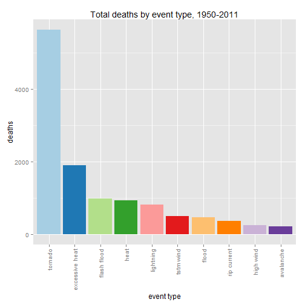
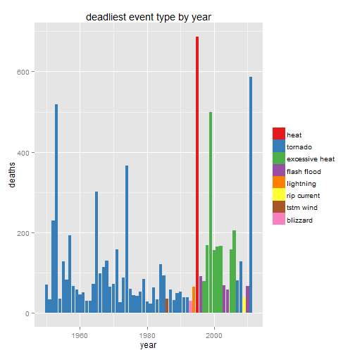
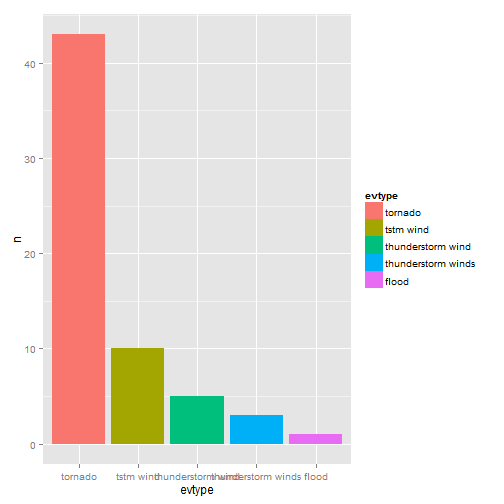

---
output:
  html_document:
    keep_md: yes
---
<center># NOAA Storm Data</center>
## JHU-DS Reproducible Research Peer Assesment 2  
This is the second peer assessment required for the JHU Reproducible Research course through Coursera. The project examines data from the National Oceanic and Atmospheric Administrations' severe weather database in order to answer basic questions about storm events. This project uses R throughout.

##<center>Data Processing</center>
###Dataset
The data come from the NOAA National Climatic Data Center Storm Events database, and cover years 1950 to 2011.  
###Prep the workspace
Load required libraries:

```r
wd <- "C:/Users/Kitt/Documents/GitHub/noaastormdata"
if(getwd()!=wd) setwd(wd)
library(data.table)
library(R.utils)
library(ggplot2)
library(gridExtra)
library(dplyr)
```

###Download the data
Then download the data, and load the data into memory:

```r
url <- "https://d396qusza40orc.cloudfront.net/repdata%2Fdata%2FStormData.csv.bz2"
fn <- "stormdata.csv"
if(!file.exists(fn)) download.file(url, fn, mode="wb")
if(!file.exists(fn)) bunzip2("stormdata.bz2", fn, remove=FALSE)
storm <- read.csv(fn)
dt1 <- data.table(storm)
rm(storm)
```

###Data Cleaning

Function to convert the separate date and time fields into one POSIXct date and time. The time zone was not included because the data set does not contain standard time zone abbreviations; incorporating the time zones would have involved guessing at most of the values.


```r
# unifTime converts all the weird time entries into a uniform time format
unifTime <- function(char.time){
    if(nchar(char.time) > 4){
        t <- substr(char.time, 0, 5)
    } else if(nchar(char.time) <= 4){
        y <- sprintf("%04s", char.time)
        t <- paste(substr(y, 0, 2), substr(y, 3, 4), sep=":")
    } else {
        break()
    }
    return(t)
}
```


```r
setnames(dt1, tolower(names(dt1)))
to.keep <- c("state", "evtype", "bgn_date", "bgn_time", "mag", "fatalities", "injuries", "propdmg", "propdmgexp", "cropdmg", "cropdmgexp")
dt1 <- dt1[, to.keep, with=FALSE] #new table with only selected columns

dt1[, evtype:=tolower(evtype)]
dt1[, bgn_date:=as.character(bgn_date)]
dt1[, bgn_time:=as.character(bgn_time)]
dt1[, date:=as.Date(bgn_date, format="%m/%d/%Y")]
dt1[, time:=unifTime(bgn_time), by=1:nrow(dt1)]
```
##Data Analysis
Determine fatalities and injuries by event type and by year.

```r
fatal <- dt1[, sum(fatalities), by=list(evtype, year(date))]
f1 <- fatal[, sum(V1), by=evtype] #summed by event type over all years
f1.max <- f1[which.max(f1$V1)] # which is most fatal?
f2 <- fatal[, .SD[which.max(V1)], by=year]
f2.max <- count(f2, evtype) # which is most fatal by year?
f2.an <- f2[which.max(V1)] # which year was most fatal?
f3 <- dt1[, sum(fatalities), by=year(date)]
injured <- dt1[, sum(injuries), by=list(evtype, year(date))]
i1 <- injured[, sum(V1), by=evtype] #summed by event type over all years
i1.max <- i1[which.max(f1$V1)]
i2 <- injured[, .SD[which.max(V1)], by=year]
i2.max <- count(i2, evtype)
```

```r
# reorder event types by deaths
f1$evtype <- factor(f1$evtype, levels = f1$evtype[order(-f1$V1)])
f2$evtype <- factor(f2$evtype, levels = f2$evtype[order(-f2$V1)])
```

```
## Warning in `levels<-`(`*tmp*`, value = if (nl == nL) as.character(labels)
## else paste0(labels, : duplicated levels in factors are deprecated
```

```r
# create the plots
g.f1 <- ggplot(f1[order(-f1$V1)][1:10], aes(x=evtype, y=V1))
g.f1 <- g.f1 + geom_bar(stat="identity", aes(fill=evtype)) +
    theme(axis.text.x=element_text(angle=90, vjust=0.5, hjust=1)) +
    xlab("event type") + ylab("deaths") +
    scale_fill_brewer(palette="Paired") + guides(fill=FALSE) + 
    ggtitle("Total deaths by event type, 1950-2011")
g.f2 <- ggplot(f2, aes(x=year, y=V1))
g.f2 <- g.f2 + geom_bar(stat="identity", aes(fill=f2$evtype)) +
    scale_fill_brewer(palette="Set1") + ylab("deaths") + xlab("year") +
    ggtitle("deadliest event type by year") +
    guides(fill=guide_legend(title=NULL))
g.f3 <- g.f2 + geom_bar(stat="identity", aes(fill=f2$evtype)) +
    scale_fill_brewer(palette="Set1") + ylab("deaths") + xlab("year") +
    ggtitle("deadliest event type by year") +
    guides(fill=guide_legend(title=NULL)) +
    geom_line(data=f3, aes(x=year, y=V1))
```

```
## Scale for 'fill' is already present. Adding another scale for 'fill', which will replace the existing scale.
```

```r
# plot the plot
g.f1
```

 

```r
g.f2
```

```
## Warning in `levels<-`(`*tmp*`, value = if (nl == nL) as.character(labels)
## else paste0(labels, : duplicated levels in factors are deprecated
```

 

```r
# convert propdmexp and cropdmgexp into multiplicative factors
focConv <- function(exp.type){
    exp.type <- tolower(exp.type)
    if(exp.type=="b") return(1e9)
    if(exp.type=="m") return(1e6)
    if(exp.type=="k") return(1e6)
    if(exp.type=="h") return(1e3)
    if(exp.type=="?") return(1)
    if(exp.type=="+") return(1)
    if(exp.type=="-") return(1)
    if(exp.type=="") return(1)
    return(as.numeric(paste("1e", as.character(exp.type), sep="")))
}
dt2 <- copy(dt1)
dt2[, prop.mult:=focConv(propdmgexp), by=1:nrow(dt2)]
dt2[, crop.mult:=focConv(cropdmgexp), by=1:nrow(dt2)]
# adjust propdmg and cropdmg to actual values
dt2[, dmg.property:=propdmg*prop.mult]
dt2[, dmg.crops:=cropdmg*crop.mult]
# overall
combined <- dt2[, sum(dmg.property, dmg.crops), by=list(evtype, year(date))]
combined.ev <- combined[, sum(V1), by=evtype] # in total over 1950-2011
# by year
combined.an <- combined[, sum(V1), by=year]
combined.max <- combined.ev[which.max(V1)] # worst event in total
c.an <- combined[, .SD[which.max(V1)], by=year]
c.an.max <- count(c.an, evtype)
# worst year
combined.wan <- combined.an[which.max(V1)] # worst year - all sources
wan.even <- combined.ev[which.max(combined.an[which.max(V1)])] # worst event in that year
```
##<center>Results</center>
Across the US, which types of events are the most harmful to population health?
###Population Health Impact  
Tornadoes are the deadliest and most injurious adverse weather events, as measured by the total number of people killed and injured. In total, 5633 people were killed by tornadoes between 1950 and 2011. 9.1346 &times; 10<sup>4</sup> people were injured by tornadoes during the same time period.  

The deadliest event in a year has changed over time. From 1950 until about 1992 tornadoes were the deadliest type of adverse weather event. However, excessive heat (and just plain "heat"") were the deadliest events in the 1990s and early 2000s.    
The dealiest year in the dataset was 1995, when 687 people died from heat.  

###Economic Impact
Tornadoes were also the event which caused the most damage to crops and property. Tornadoes caused a total of 3.3171229 &times; 10<sup>12</sup> dollars worth of reported damage from 1950 to 2011.
Tornadoes were the most economically damaging events for 43 out of the 62 surveyed years. Thunderstorm winds made up the next-highest category, with 18 out of 62 years. Floods were the most damaging event for only one out of the 62 years surveyed.

```r
c.an.max$evtype <- factor(c.an.max$evtype, levels = c.an.max$evtype[order(-c.an.max$n)])
g.ec <- ggplot(c.an.max, aes(x=evtype, y=n))
g.ec + geom_bar(stat="identity", aes(fill=evtype))
```

 
##<center>Discussion</center>
###Recommendations
1. Tornadoes seem to be a significant cause for concern, both in terms of economic loss and in terms of public health. Steps should be taken to mitigate the impact of these adverse weather events - imporved bilding codes and improved warning systems will likely reduce deaths and injuries associated with these storms. Insurance rates can be adjusted to reflect the loss to property.
2. Data are not coded consistently, and a more rigorous attempt to standardize that data recording format would result in superir analysis.
###Issues
The data are incomplete and inconsistent. There is no uniform method used to code various weather events, which makes analysis difficult. The time zones used in the data set do not match any recognized time zones currently in use, meaning that precise temporal analysis is difficult, if not impossible, without guessing at critical values. The data recorded reflect only a portion of actual losses; until the 1980s tornadoes are the only adverse weather events recorded, which is highly unlikely and leads to skewed analysis.
